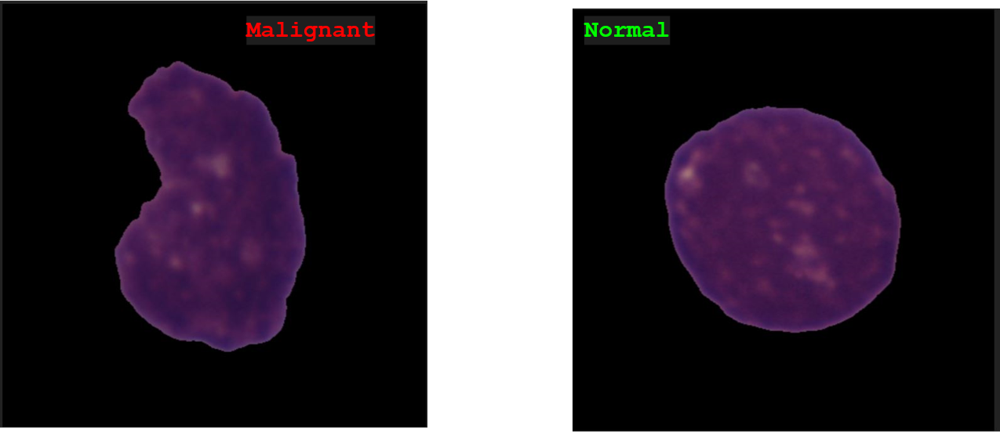
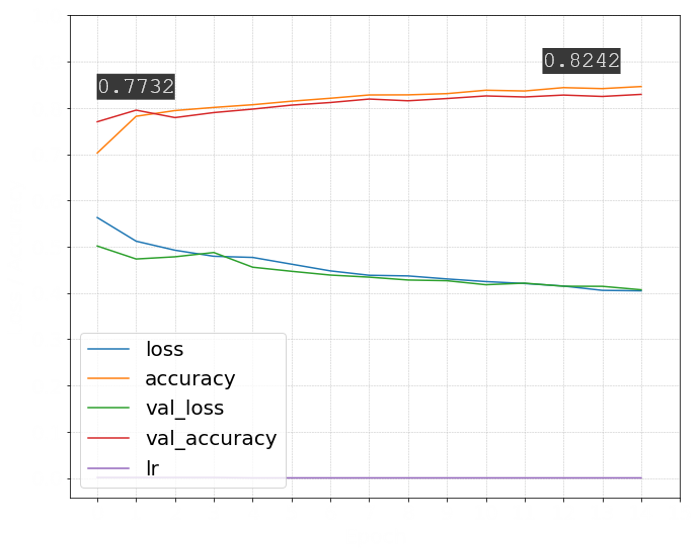
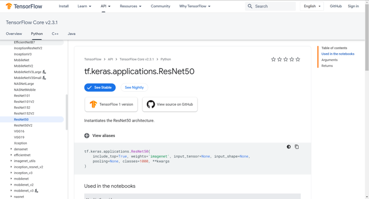
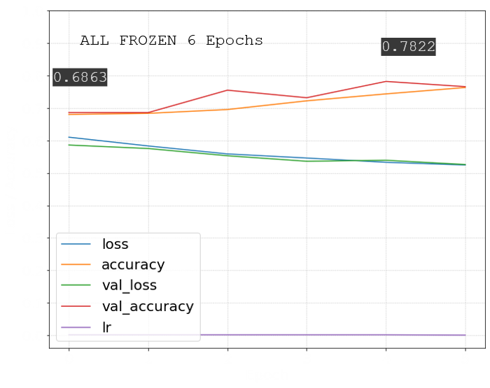
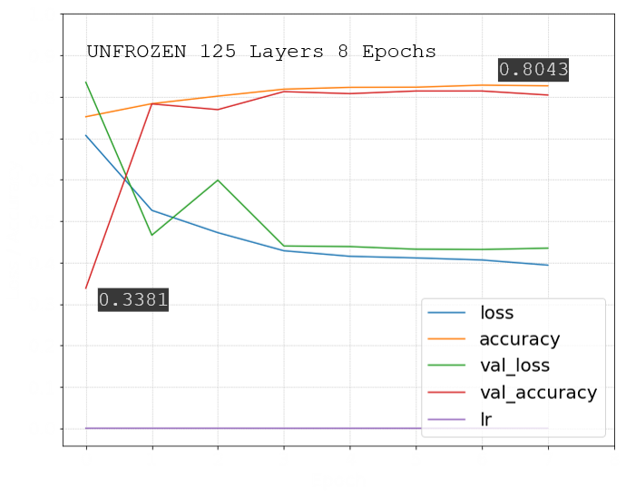

# Machine Learning I Final Project Detecting leukemic B-lymphoblast cells (cancer cells) from normal B-lymphoid precursors (normal cells) from blood smear microscopic images using CNN

The remarkable advances in image recognition technology through Machine Learning algorithims has lead many businesses of different presuaions to seek utilizing its uses. It is applied in areas such as social media image tagging, self-driving car technology, security and medical research. This project aims to assess the accuracy of a built-from-scratch CNN model and a ResNet50 pre-trained transfer learning CNN model in distingushing leukemic B-lymphoblast cells from healthy B-lymphoid precursors. The images are microscopic images of blood smear samples for patients who are healthy and others who have been diagnosed with Leukemia.

https://www.kaggle.com/andrewmvd/leukemia-classification and https://biomedicalimaging.org 
These lymphocyte cells have been segmented from the microscopic images and they are representative of images in the real-world in that they contain staining noise and illumination errors. 
- The images are size 450x450x3 labeled _all for cancer cell images and _hem for healthy cells.
- 69 cancer subjects and 49 Normal subjects.
- Train set composition:
  Total images: 10,671. ALL: 7,272 and HEM: 3,389.
- Test set composition:
  Total images: 1,867. ALL: 1,219 and HEM: 648.
- Shuffled, Reshaped to 45x45x3 and scaled /255.

## CNN Model from Scratch
- Four Convolutional layers, with ascending increase in number of Neurons 32, 64, 128, 256. Second, Third and Fourth layers consist of two Sublayers
- Four Pooling layers with Max activation function
- One Flatten layer followed by three dense layers with drop-out
- Output Layer Sigmoid
- Adam optimizer, Binary Cross Entropy and 15 Epochs.

Validation and training accuracy and loss results 

## CNN Model using ResNet50 Pre-trained Model

- Train model with frozen pre-trained base model ResNet50 with “imagenet” weights.
- Added an Average Pooling layer and output layer with sigmoid activation.
- Validation accuracy lower than “from scratch” model.

Validation and training accuracy and loss results with all layers frozen 

## Fine Tuned ResNet50 Model
- Unfroze 125/175 layers and allowed them to be trained with the model again with lower optimizer learning rate.

## Test set accuracy results
Model | Test Set Accuracy 
------|------------------
From Scratch | 0.70
Fine tuned ResNet50 | 0.70

